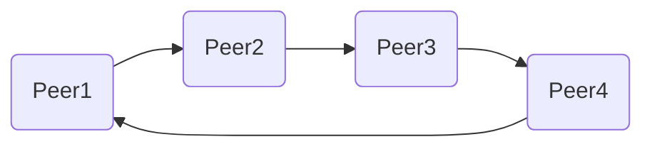

# progreseaux_TP4




Se connecter via un navigateur à l'adresse http://localhost/ pour voir les fichiers

```curl "http://localhost/add/test.txt?data=test"``` pour ajouter un fichier

RAFT  
go run .\raft.go --node-id 0 --raft-port 6789 --http-port 8989

Client  
go run .\client.go 127.0.0.1:667 127.0.0.1:1000

V1  
go run .\server_dht.go 127.0.0.1:1000 A-F 127.0.0.1:1001 Peer1  
go run .\server_dht.go 127.0.0.1:1001 G-L 127.0.0.1:1002 Peer2  
go run .\server_dht.go 127.0.0.1:1002 M-R 127.0.0.1:1003 Peer3  
go run .\server_dht.go 127.0.0.1:1003 S-Z 127.0.0.1:1000 Peer4  

V2  
Config file in Config folder  
go run .\server_dht.go 127.0.0.1:1000 Peer1  
go run .\server_dht.go 127.0.0.1:1001 Peer2  
go run .\server_dht.go 127.0.0.1:1002 Peer3  
go run .\server_dht.go 127.0.0.1:1003 Peer4  


Peer1   
G-L 127.0.0.1:1001  
S-Z 127.0.0.1:1003  

Peer2  
A-F 127.0.0.1:1000  
M-R 127.0.0.1:1002  

Peer3  
G-L 127.0.0.1:1001  
S-Z 127.0.0.1:1003  

Peer4  
M-R 127.0.0.1:1002  
A-F 127.0.0.1:1000  